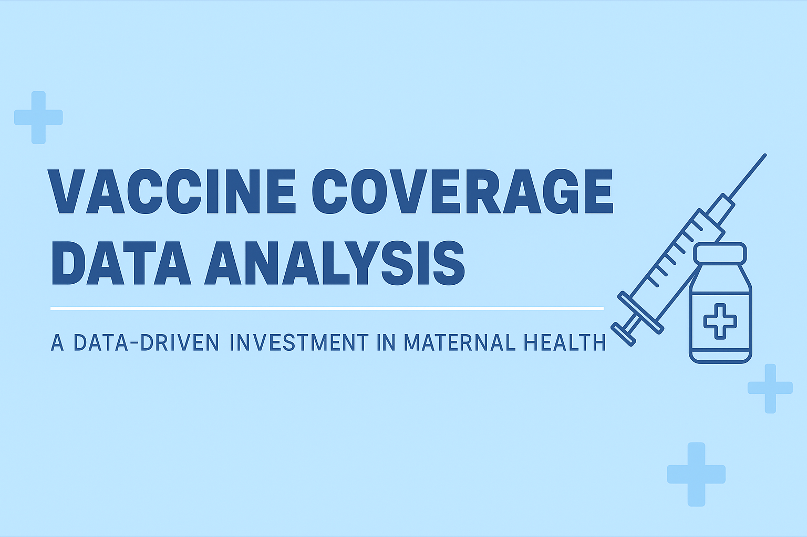
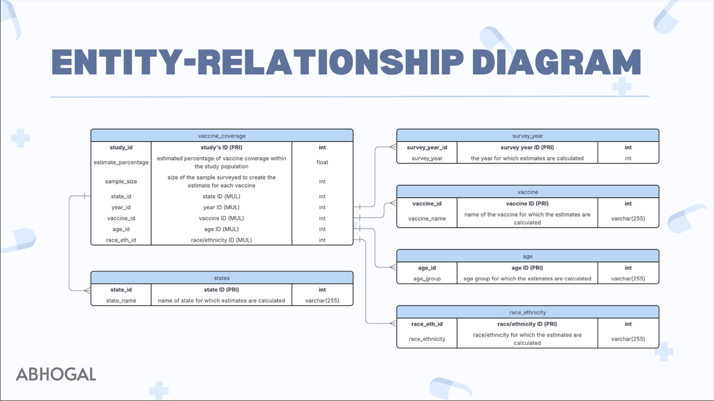

# 💉 Vaccine Coverage Data Analysis  
### *A Data-Driven Investment in Maternal Health*  
**Author:** Amanpreet Bhogal  

---

## 🧠 Project Overview  

This project analyzes **vaccination coverage among pregnant women (CDC 2022)** to identify **states** and **racial/ethnic groups** with low coverage rates.  
The goal: guide **targeted public-health investments** promoting the *safety and protectiveness* of maternal vaccines.  

I built the database schema, designed an **ERD**, wrote analytical **SQL queries**, and summarized insights in a final **presentation** connecting data analytics to real-world impact.  

Data Source: https://data.cdc.gov/Pregnancy-Vaccination/Vaccination-Coverage-among-Pregnant-Women/h7pm-wmjc/about_data

---

## 🧩 Database Design  

The raw CDC dataset (~2 000 rows) was cleaned, filtered, and **normalized** into six tables:

| Table | Description |
|:------|:-------------|
| 🧾 `vaccine_coverage` | Primary fact table containing estimated vaccination coverage (`estimate_percentage`) |
| 🗺️ `states` | State-level geographic identifiers |
| 📅 `survey_year` | Year of study or influenza season |
| 💉 `vaccine` | Vaccine type (Influenza, Tdap) |
| 👶 `age` | Age group of participants |
| 🌎 `race_ethnicity` | Racial/ethnic classification of participants |


---

## 🧱 Entity-Relationship Diagram  

  

The ERD visualizes how `vaccine_coverage` connects to `states`, `survey_year`, `vaccine`, `age`, and `race_ethnicity` via foreign keys.

---

## 🧮 SQL Analysis  

Each query addressed a distinct public-health question:

| Question | Key SQL Concept |
|:----------|:----------------|
| 🧩 Which study had the smallest vaccine coverage? | `ORDER BY … LIMIT` |
| 📊 What is the overall average coverage? | `AVG()` aggregation |
| 🗺️ Which states fall below the national average? | `GROUP BY + HAVING` |
| 🌎 Which racial/ethnic group has the lowest coverage? | `JOIN + GROUP BY` |
| 💉 How many studies covered Influenza vs Tdap? | `COUNT()` grouping |

➡️ See all queries in [`vaccine_queries.sql`](vaccine_queries.sql)

---

## 📊 Findings & Insights  

### 👥 1. Racial / Ethnic Disparities  
- **Black, Non-Hispanic** pregnant women had the **lowest coverage (~19%)**  
- **White, Non-Hispanic** women had the **highest (~32%)**  
> 🎯 *Investments should focus on addressing barriers and building trust in underserved populations.*

---

### 🗺️ 2. States Below National Average  
Overall average vaccine coverage: **63.95 %**  
States below this benchmark:  
**Oklahoma • New York • Wyoming • Maine • Alabama • Montana • New Mexico • Kentucky • North Dakota • Michigan**  
> 🏥 *High-impact opportunities for targeted awareness and outreach.*

---

## 💼 Business Application  

This analysis supports **data-driven public-health investment** by pinpointing underserved demographics and regions.  
Insights can inform:  
- 💰 **Funding allocation** for outreach programs  
- 📣 **Education campaigns** emphasizing maternal vaccine safety**  
- 🤝 **Community partnerships** to increase vaccine accessibility  

---

## 🧰 Tools & Technologies  

| Tool | Role |
|:-----|:-----|
| 🧮 **DataGrip / MySQL** | Database creation, schema design, querying |
| 🧱 **SQL** | Data wrangling, joins, aggregation, normalization |
| 🧭 **Lucidchart** | ERD and schema visualization |
| 📊 **Canva** | Final business presentation design |

---

## 🗂 Repository Structure  

```
vaccine-coverage-sql-database/
├── assets/
│   ├── vaccine_ERD.png
│   └── vaccine_coverage_header.png
├── presentation/
│   └── vaccine_presentation.pdf
├── queries/
│   └── vaccine_queries.sql
├── vaccine_schema.sql
└── README.md

```

---

## 🎓 Author  

**Amanpreet Bhogal**  
🎓 Master of Health Informatics | University of Michigan   
🔗 [LinkedIn](https://linkedin.com/in/amanpreetbhogal)

---

## 🧾 Project Presentation  

📂 [View the full project presentation (PDF)](presentation/vaccine_presentation.pdf)  
This presentation summarizes my findings, ERD design, and key business recommendations for data-driven investment in vaccine coverage.
